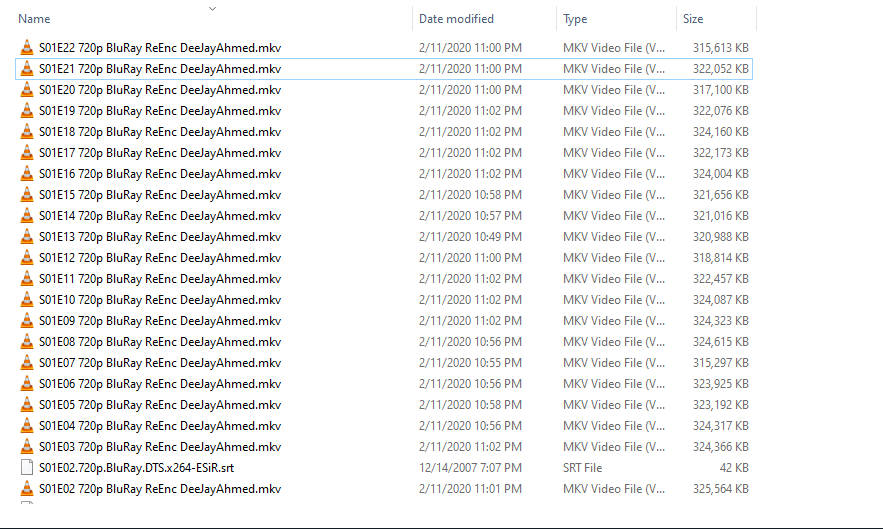
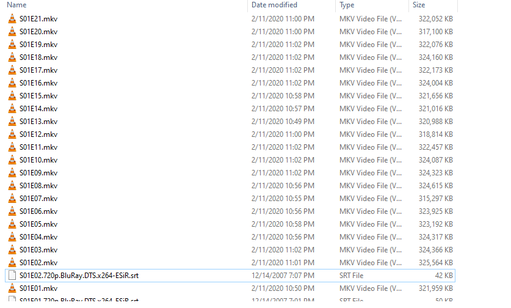

## Example
### 1 - Files have to change name

  

### 2 - Run this code
 
<code>
changeFilesName('C:\\Users\\Erdem\\Downloads\\PrisonBreakS01',' 720p BluRayReEnc DeeJayAhmed','','.mkv')
</code>
 

### 3 - Result

  

